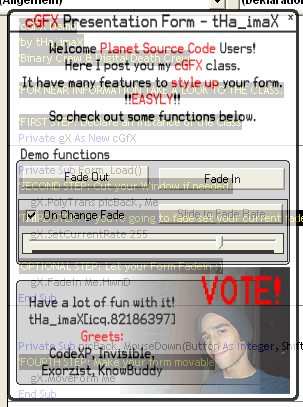

<div align="center">

## \[\!\!VOTE\!\!\] cGFX \- Style up Your Form Class\!


</div>

### Description

The cGFX Class allows you to make super SEXY tools in seconds!!! A Demonstration tool is includet!
 
### More Info
 
No Params

No Returns

No Side Effects


<span>             |<span>
---                |---
**Submitted On**   |2003-12-27 06:08:20
**By**             |[tHa\_imaX](https://github.com/Planet-Source-Code/PSCIndex/blob/master/ByAuthor/tha-imax.md)
**Level**          |Intermediate
**User Rating**    |4.1 (37 globes from 9 users)
**Compatibility**  |VB 6\.0
**Category**       |[Graphics](https://github.com/Planet-Source-Code/PSCIndex/blob/master/ByCategory/graphics__1-46.md)
**World**          |[Visual Basic](https://github.com/Planet-Source-Code/PSCIndex/blob/master/ByWorld/visual-basic.md)
**Archive File**   |[cGFX\_\-\_Sty1841721192005\.zip](https://github.com/Planet-Source-Code/tha-imax-vote-cgfx-style-up-your-form-class__1-58375/archive/master.zip)

### API Declarations

```
Private Declare Function SetWindowRgn Lib "user32" _
(ByVal HwnD As Long, ByVal hRgn As Long, _
ByVal bRedraw As Boolean) As Long
Private Declare Function CreateRectRgn Lib "gdi32" _
(ByVal X1 As Long, ByVal Y1 As Long, ByVal X2 As Long, _
ByVal Y2 As Long) As Long
Private Declare Function CombineRgn Lib "gdi32" _
(ByVal hDestRgn As Long, ByVal hSrcRgn1 As Long, _
ByVal hSrcRgn2 As Long, ByVal nCombineMode As Long) As Long
Private Declare Function SendMessage Lib "user32" Alias _
"SendMessageA" (ByVal HwnD As Long, ByVal wMsg As Long, _
ByVal wParam As Long, lParam As Any) As Long
Private Declare Function ReleaseCapture Lib "user32" () As Long
Private Declare Function DeleteObject Lib "gdi32" _
(ByVal hObject As Long) As Long
Private Declare Function GetWindowLong Lib "user32.dll" Alias "GetWindowLongA" (ByVal HwnD As Long, ByVal nIndex As Long) As Long
Private Declare Function SetWindowLong Lib "user32.dll" Alias "SetWindowLongA" (ByVal HwnD As Long, ByVal nIndex As Long, ByVal dwNewLong As Long) As Long
Private Declare Function SetLayeredWindowAttributes Lib "user32.dll" (ByVal HwnD As Long, ByVal crKey As Long, ByVal bAlpha As Byte, ByVal dwFlags As Long) As Long
Private Declare Function UpdateLayeredWindow Lib "user32.dll" (ByVal HwnD As Long, ByVal hdcDst As Long, pptDst As Any, psize As Any, ByVal hdcSrc As Long, pptSrc As Any, crKey As Long, ByVal pblend As Long, ByVal dwFlags As Long) As Long
```


